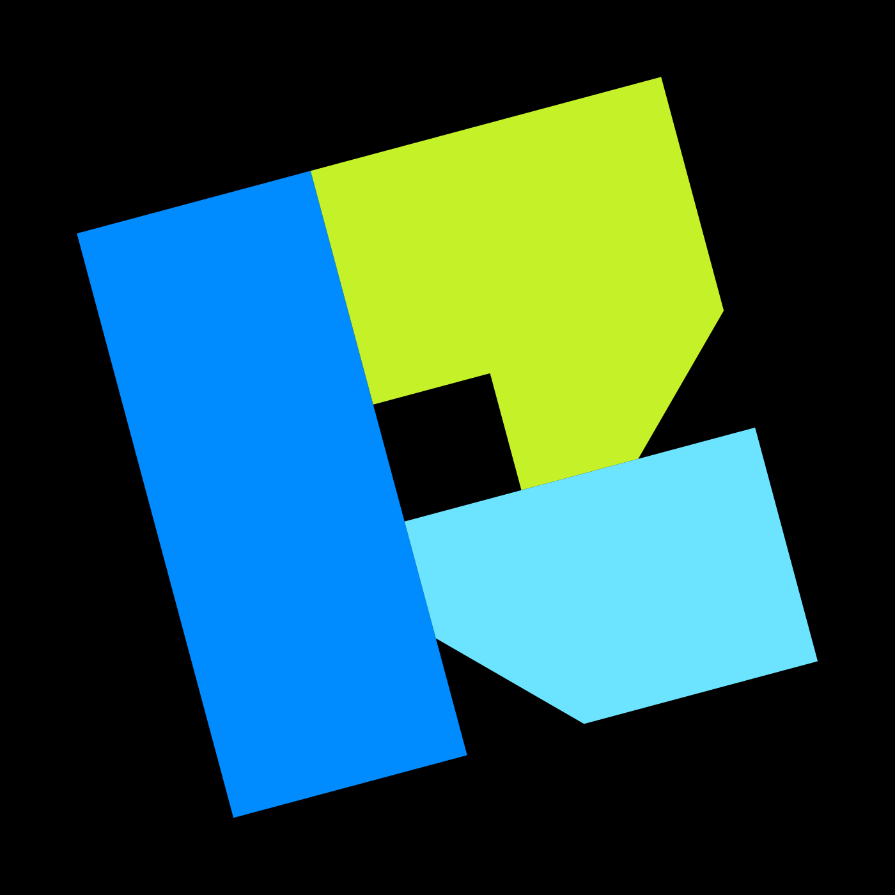

<p align="center">
  
</p>

<h1 align="center">Retro Diffusion MCP Server</h1>

<p align="center">
  Generate <b>real pixel art</b> — sprites, characters, animations, and tilesets — from any MCP-capable AI assistant.<br>
  Grid-aligned pixels, controlled palettes, transparent backgrounds. Not "pixel-art style" images. The real thing.
</p>

<p align="center">
  <a href="https://retrodiffusion.ai">Website</a> ·
  <a href="https://astropulse.gitbook.io/retro-diffusion">API Docs</a> ·
  <a href="https://github.com/Retro-Diffusion/api-examples">API Examples</a> ·
  <a href="https://discord.gg/retrodiffusion">Discord</a>
</p>

<p align="center">
  <a href="cursor://anysphere.cursor-deeplink/mcp/install?name=retro-diffusion&config=eyJ1cmwiOiJodHRwczovL21jcC5yZXRyb2RpZmZ1c2lvbi5haS9tY3AiLCJoZWFkZXJzIjp7IkF1dGhvcml6YXRpb24iOiJCZWFyZXIgWU9VUl9BUElfS0VZIn19"></a>
  
  
</p>

---

This is a **hosted, remote MCP server** — nothing to install or run locally. Point your client at the endpoint, add your API key, and your assistant can browse 90+ pixel art styles, estimate costs for free, and generate game-ready art.

```
Endpoint:  https://mcp.retrodiffusion.ai/mcp     (Streamable HTTP)
Auth:      Authorization: Bearer <your API key>   (keys start with rdpk-)
```

## Get an API key (2 minutes)

1. Create a free account at [retrodiffusion.ai](https://retrodiffusion.ai) — new accounts include free starter credits.
2. Open [Developer Tools](https://retrodiffusion.ai/app/devtools) and click **Create API Key**.

Pricing is pay-per-generation (from ~$0.01 per image), prepaid, **no subscription, and credits never expire**. Cost estimation is always free, so your agent can check the price of anything before spending.

## Setup by client

### Claude Code

```bash
claude mcp add --transport http retro-diffusion https://mcp.retrodiffusion.ai/mcp \
  --header "Authorization: Bearer rdpk-YOUR-KEY"
```

Or install the plugin (bundles the server plus a pixel-art workflow skill):

```
/plugin marketplace add Retro-Diffusion/retro-diffusion-mcp
/plugin install pixel-art@retro-diffusion
```

### Cursor

Click the **Add to Cursor** badge above, then replace `YOUR_API_KEY` — or add to `~/.cursor/mcp.json`:

```json
{
  "mcpServers": {
    "retro-diffusion": {
      "url": "https://mcp.retrodiffusion.ai/mcp",
      "headers": { "Authorization": "Bearer rdpk-YOUR-KEY" }
    }
  }
}
```

### VS Code (GitHub Copilot)

Add to `mcp.json` (Command Palette → "MCP: Add Server" → HTTP):

```json
{
  "servers": {
    "retro-diffusion": {
      "type": "http",
      "url": "https://mcp.retrodiffusion.ai/mcp",
      "headers": { "Authorization": "Bearer rdpk-YOUR-KEY" }
    }
  }
}
```

### Windsurf

Add to `~/.codeium/windsurf/mcp_config.json`:

```json
{
  "mcpServers": {
    "retro-diffusion": {
      "serverUrl": "https://mcp.retrodiffusion.ai/mcp",
      "headers": { "Authorization": "Bearer rdpk-YOUR-KEY" }
    }
  }
}
```

### Claude Desktop

Use [`mcp-remote`](https://www.npmjs.com/package/mcp-remote) in `claude_desktop_config.json`:

```json
{
  "mcpServers": {
    "retro-diffusion": {
      "command": "npx",
      "args": [
        "mcp-remote",
        "https://mcp.retrodiffusion.ai/mcp",
        "--header",
        "Authorization: Bearer rdpk-YOUR-KEY"
      ]
    }
  }
}
```

### Anything else

Any MCP client that speaks Streamable HTTP works: URL `https://mcp.retrodiffusion.ai/mcp`, header `Authorization: Bearer rdpk-YOUR-KEY`.

## Tools

| Tool | What it does |
|---|---|
| `authenticate` | Validate an API key and attach it to the session |
| `get_balance` | Check remaining prepaid balance and credits |
| `list_available_models` | The model families: RD Fast, RD Plus, RD Pro, RD Mini, animations, tilesets |
| `list_available_styles` | Live style catalog with per-style size limits and capabilities |
| `get_style_usage` | Usage guidance and constraints for a specific style |
| `estimate_inference_cost` | **Free** price check for any generation before running it |
| `create_inference` | Generate images, animations (GIF/sprite sheet), or tilesets |
| `create_user_style` | Create a custom style from a reference image (RD Pro template) |
| `update_user_style` | Modify one of your custom styles |
| `delete_user_style` | Remove one of your custom styles |
| `logout` | Clear the stored session key |

## What you can make

- **Sprites & characters** — 90+ styles: portraits, game assets, isometric, top-down, platformer, 1-bit, Minecraft items/textures, UI elements, item sheets, character turnarounds
- **Animations** — walk/idle/jump/crouch/attack cycles from a start frame, four-angle walk cycles, 8-direction rotations, VFX, battle sprites; GIF or sprite-sheet output
- **Tilesets** — Wang/blob tilesets, tile variations, single tiles, scene objects
- **Consistent characters** — generate once with RD Pro, then pass the output as a reference image in follow-up generations (up to 9 references)
- **Edits** — img2img, seamless tiling, transparent backgrounds, palette-constrained output

Example prompts to try once connected:

> "List the available pixel art styles for animations, then estimate what a 64×64 walking animation would cost."

> "Generate a 128×128 pixel art knight resting by a campfire, RD Pro default style, transparent background."

> "Create a 16×16 Wang tileset: grey stone path tiles blending into lush grass."

## Prompting tips (important)

- **Describe the subject only** — never write "pixel art" in the prompt; the style handles the rendering.
- Sizes run 16×16 to 384×384 depending on style; `list_available_styles` gives exact per-style limits.
- Costs range from ~$0.015 (RD Fast) to $0.18/image (RD Pro); animations $0.07–$0.25; tilesets $0.10. `estimate_inference_cost` is always free — use it first.
- Reuse a seed to iterate on the same composition while changing only the prompt.

## Who makes this

Retro Diffusion is built by [Astropulse](https://x.com/RealAstropulse) — a pixel artist with seven years of freelance experience before building the tool — and is used in production by studios and platforms including Replicate, Poe (Quora), and Scenario. It's designed by artists and held to artist-grade quality standards.

## Support

- [Discord community](https://discord.gg/retrodiffusion) — fastest answers, the founder is active daily
- [Full API reference](https://astropulse.gitbook.io/retro-diffusion) and [runnable examples](https://github.com/Retro-Diffusion/api-examples)
- [Service status](https://api.retrodiffusion.ai/v1/status) (no auth required)

## License

The contents of this repository (documentation and manifests) are [MIT licensed](LICENSE). The Retro Diffusion service itself is governed by its [Terms of Service](https://retrodiffusion.ai/terms).
